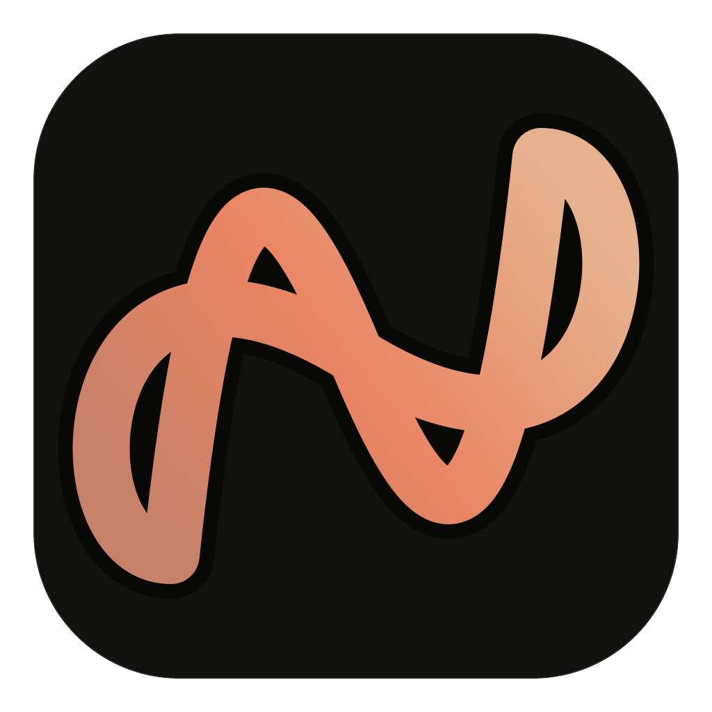

# AngelNotch

<p align="center">
  
</p>

<p align="center">
  <strong>Your Mac, at a glance.</strong>
</p>

<p align="center">
  <a href="https://angelnotch.ng">Website</a> ·
  <a href="https://github.com/Samuellyworld/AngelNotch/releases/latest">Download</a>
</p>

AngelNotch is a local-first macOS utility that turns the MacBook notch into a
compact, expandable workspace for media, clipboard history, files, focus,
calendar events, system controls, and live activities.

<p align="center">
  
</p>

## Download

Download the latest DMG from [GitHub Releases](https://github.com/Samuellyworld/AngelNotch/releases/latest),
open it, and drag AngelNotch into the Applications folder.

## Features

- Control Spotify, Apple Music, YouTube, and YouTube Music playback.
- Search, pin, preview, copy, and remove local clipboard history.
- Keep files in a persistent shelf with Quick Look, Share, and AirDrop.
- Run a configurable focus timer with offline Idera voice announcements.
- View upcoming calendar events and open supported meeting links.
- Control volume, brightness, microphone state, and audio output.
- See battery, camera, active-call, and model-aware connected-AirPods indicators.
- Follow local activities such as Chrome download progress.
- Adapt quick actions to the application currently in use.

## Requirements

- macOS 14 or newer
- Swift 6 through Xcode or Apple Command Line Tools
- Node.js and npm only if you want the optional Chrome extension

## Run from source

```sh
swift run --package-path app AngelNotch
```

AngelNotch runs as a menu-bar app. Use the menu-bar icon or the global shortcut
to open it.

## Build a local app

```sh
./scripts/package-app.sh
open "dist/.build/AngelNotch.app"
```

The local app bundle is created at `dist/.build/AngelNotch.app`.

## Global shortcuts

| Action | Shortcut |
| --- | --- |
| Open or close AngelNotch | `⌥ Space` |
| Open clipboard history | `⌃⌥ V` |
| Start a screenshot | `⌃⌥ S` |

## Optional Chrome extension

The Chrome extension adds YouTube playback state and Chrome download progress.
The rest of AngelNotch works without it.

First build the local app, then run:

```sh
npm ci --prefix chrome-extension
npm --prefix chrome-extension run build
./chrome-extension/install-host.sh
```

In Chrome:

1. Open `chrome://extensions`.
2. Enable **Developer mode**.
3. Choose **Load unpacked**.
4. Select the repository's `chrome-extension` folder.
5. Reload the extension and any open YouTube tab.

## Permissions

AngelNotch may request access when a related feature is used:

| Permission | Purpose |
| --- | --- |
| Automation | Read and control Spotify or Apple Music |
| Calendar | Show the next event and its meeting link |
| Call activity | Display an orange animated waveform while a call is active |
| Camera | Display a camera-in-use indicator |

The call waveform is an activity indicator and does not capture microphone audio.
AirPods battery progress is shown only when macOS publishes a real accessory
battery value; otherwise the UI shows connection status without implying a battery
percentage.

## Local data and privacy

Clipboard history, file bookmarks, focus state, and integration data remain on
the Mac. AngelNotch has no account system, analytics, advertising, or tracking
SDKs. The data folder can be opened from AngelNotch Settings.

## Validate the project

Install the Chrome extension dependencies once:

```sh
npm ci --prefix chrome-extension
```

Then run:

```sh
./scripts/validate.sh
```

Validation checks the Swift package, Swift formatting, TypeScript extension,
JSON manifests, application metadata, icons, bundled voice assets, and shell
scripts.

## Contributing

Contributions are welcome. Keep changes focused, readable, and consistent with
the existing project structure.

1. Enable the repository's Swift pre-commit hook once after cloning:

   ```sh
   git config core.hooksPath .githooks
   ```

2. Create a branch for the change.
3. Make the smallest complete change that solves the problem.
4. Format Swift code with:

   ```sh
   swift format format --in-place app/Package.swift
   swift format format --in-place --recursive app/sources
   ```

5. Install the extension dependencies if needed:

   ```sh
   npm ci --prefix chrome-extension
   ```

6. Run `./scripts/validate.sh`.
7. Open a pull request explaining the change and how it was tested. Include a
   screenshot or short recording for visible interface changes.

Do not commit build output, dependency folders, caches, local app data, or
credentials.

## Project structure

```text
app/
  Package.swift                 Swift package manifest
  resources/
    media/                      bundled offline voice announcements
  sources/
    angelnotch/                 macOS app
      app/                      lifecycle, settings, and shared state
      core/                     design tokens and infrastructure
      features/                 activities, calendar, clipboard, files,
                                focus, media, and system controls
      ui/                       notch composition and shared controls
    angelnotch-native-host/     Chrome native-messaging helper
    angelnotch-service-bridge/  launch-at-login bridge
chrome-extension/               optional browser extension
resources/                      app metadata, icons, and demo
scripts/                        local build and validation tools
```

## Author

Created and maintained by [Samuel Tosin](https://github.com/Samuellyworld).
